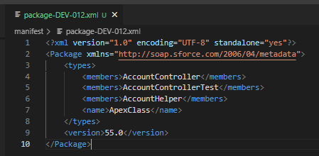
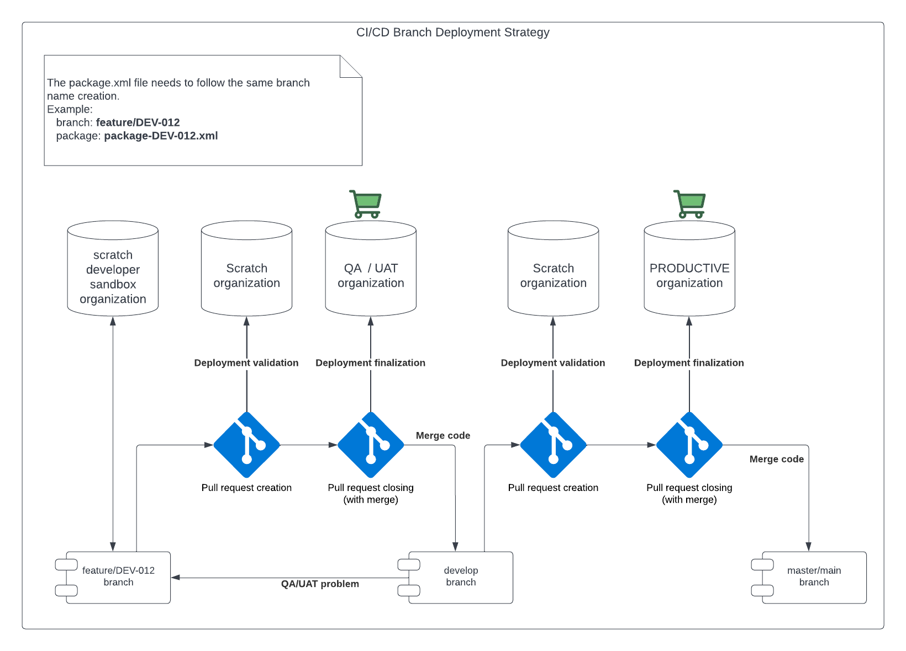
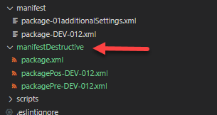
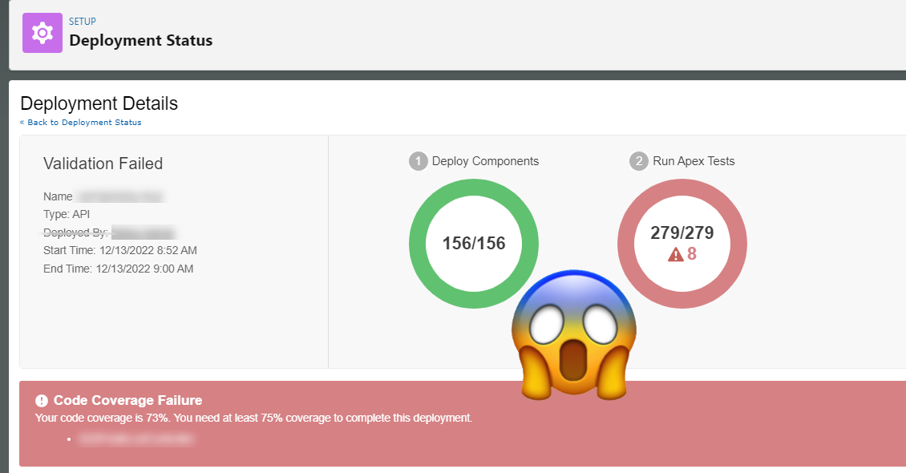
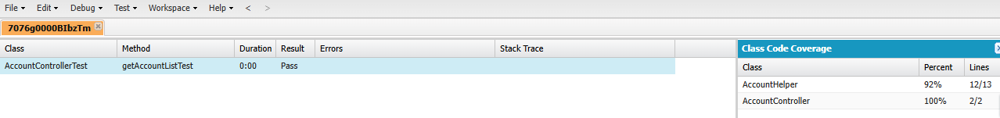
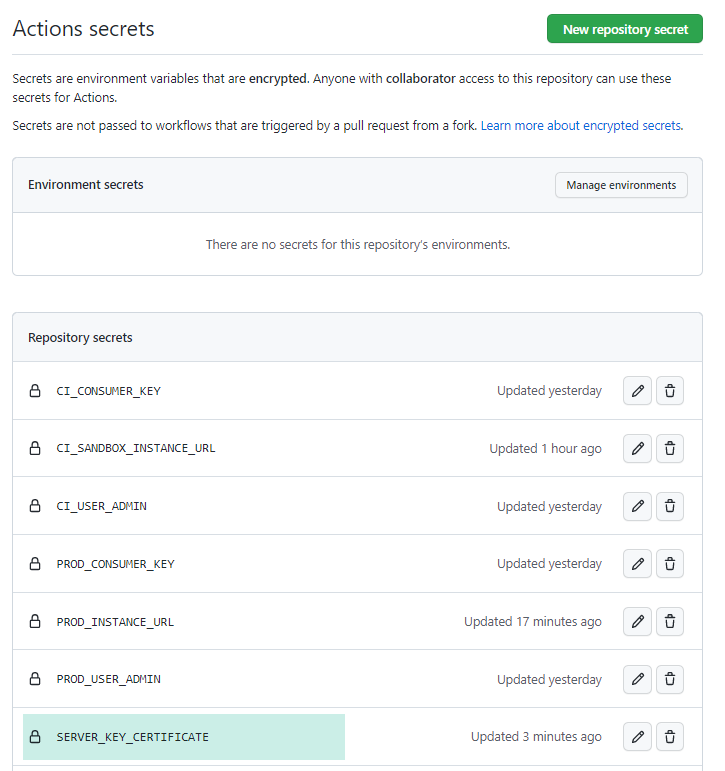
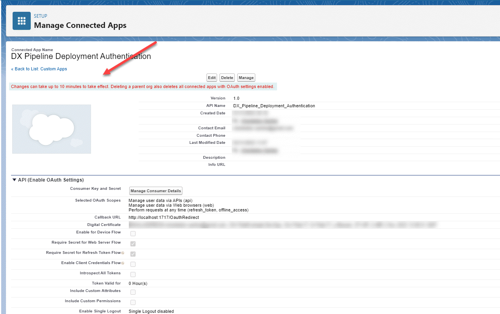
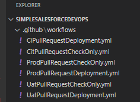
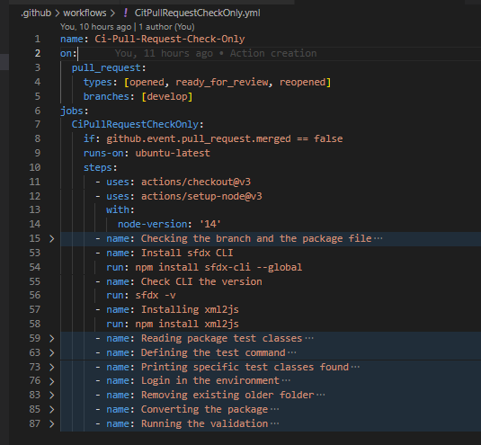
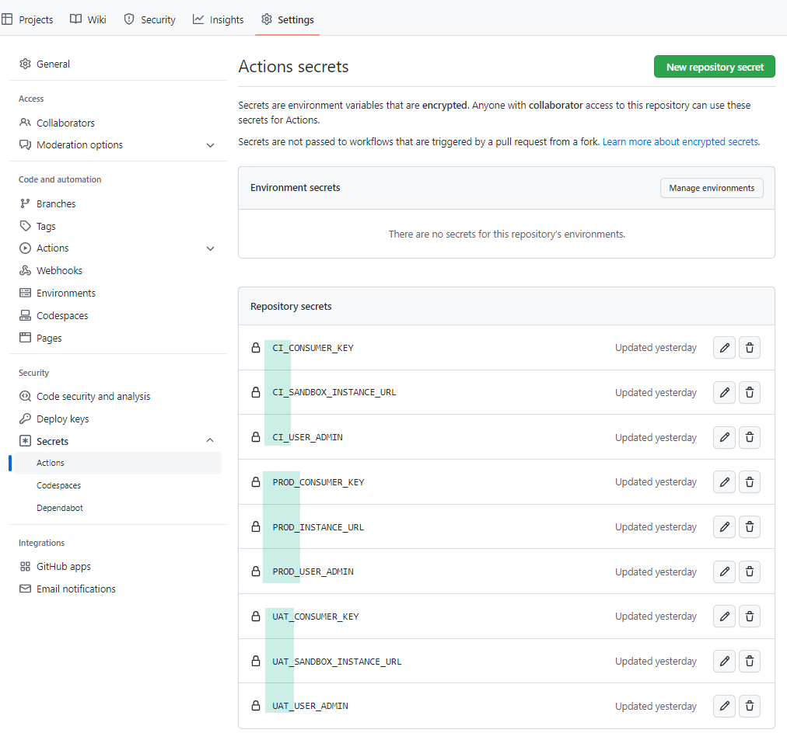

# Simple Salesforce DevOps (CI/CD)

This repository shows the necessary things to get workflows and actions running on github.
For bitbucket the things are almost the same, the only difference will be:
* Github calls it as **actions**;
* Bitbuckt calls it as **workflows**;

For sure, the configuration part are not the same in both, but *understanding the idea explained here*, you can do it.

Despite the activities done here are a little bit different of this one, you can [check on this trailhead](https://trailhead.salesforce.com/content/learn/modules/git-and-git-hub-basics) some steps very similar that  could be a good starting point, since the real one I was looking for (related with CI/CD), is not available anymore (at least, I have not found).

Well, we'll do deployments directly with pull request, passing by the following environments:
1. Developer orgs (CI);
1. Developer orgs (UAT as CD), and... 
1. Over again in developer org mimicking an production org.

Of course, instead of developer orgs, you'll be able to do the same on sandboxes and production orgs. And also instead of work with just pull requests, you also can use pushes and etc.

And for sure, you maybe have an QA environment, before arriving the UAT environment... Because you know, the life is not that easy.

## How the magic will happen?

Well, we intend to keep the things simple here. 

Due that, our example will follow a simple name convention strategy, and will deploy the things, based on pull requests "opening" and "closing" (after approval, or in the way you do in your work).

Step by step, it would be:
1. You create your branch following your name convetion;
    1. Let's supposed that you use "ticket numbers" created on jira, service now or wherever;
    1. The ticket to developments have the "DEV-" prefix and the number;
    1. Examples to the name DEV-012:
    1. feature/DEV-012;
    1. bugfix/DEV-012;
1. You do your development in your environment (scratch, sandbox or developer organization);
1. You create a package file in the manifest folder, following the same name convetion, with **package-BRANCH__NAME.xml**;
    * That branch name DEV-012, would have the file **package-DEV-012.xml**;
    
    
1. After finish it, you create a pull request to move forward;
    1. That pull request will be validated against the org before deploying;
    1. If everything is fine, you can merge that pull request, that will finally deploy your things in your QA/UAT or wherever you want;
1. After the testing team break your things (on QA/UAT), no sorry, I'm kidding. But sometimes, it happens... But let's think just in the happy path.
1. Now you create new a pull request to move forward;
    1. That pull request will be validated against the org (believe me, it will be needed and will work like a rehearsal strategy)
        * Being very honest, I really prefer create a sandbox based on productive environment, to really be a rehearsal, avoiding surprises;
        * Why? Well, sometimes we have different teams doing different things and moving stuffs to production, and those stuffs could break ours;
        * Other times we have some special users or support teams doing things directly to production, and the list goes on...
        * But over again, let's talk about just of the happy path!
    1. If everything is fine, you can merge that pull request, that will finally deploy your things in your PRODUCTIVE environment;

<!--  -->


Of course that will really work if you have some [branch protection rules](https://docs.github.com/en/repositories/configuring-branches-and-merges-in-your-repository/defining-the-mergeability-of-pull-requests/managing-a-branch-protection-rule) in place, to require approvals, get evidences and etc.

But its is something up to you, because actually all shown here need to be adequate to follow your needs.
<br/><br/>
## Destructive changes? Yes, we do that here!
<br/>

<!--  -->


The destructive process just follow the same strategy created before: “Naming convention“.

Based on the [Salesforce documentation](https://developer.salesforce.com/docs/atlas.en-us.api_meta.meta/api_meta/meta_deploy_deleting_files.htm) about destructive changes, the git action will follow the naming convention and will check if in the "manifestDestructive" folder exists the following files:
* packagePre-BRANCH_NAME.xml
* packagePos-BRANCH_NAME.xml



You don't need matter about "package.xml" file, just leave that there...

This will be the deployment order, case one or both files exists:
1. packagePre-BRANCH_NAME.xml - Removing the needed things before the deployment;
1. package-BRANCH_NAME.xml - Deploying and validating the apex classes;
1. packagePos-BRANCH_NAME.xml - Removing the things after the deployment;

Very simple, and behind the scenes, the git action just will do the sfdx commands below:

    ```
    sfdx force:mdapi:deploy -u [ORG_ALIAS] -d manifestDestructive -g -w -1
    ```


## How to achieve the apex classes coverage?

No miracles here my friend, everybody knows that coverage is not necessary to deploy in non-productive organizations, but believe me, is better be preperad to that, than pass by all the environments and let to discover some deployment issues just in the "go live" (whos never?).



In this example we are expecting that your apex classes also follows the name convention below:
* ApexClasName
* ApexClasNameTest

With this name convention, behind the scenes we have a [node.js file](/scripts/js/readApexTestClass.js) that will read the package looking for apex classes, and for each ones found will:
1. Get its names;
1. Concatenate with "Test";
1. Confirms if exist a test class with that name;
1. Adds the existing ones in the deployment command;

Examples in the repository:
* AccountController;
* AccountHelper;
* AccountControllerTest (that will coverage both of them);

In the ideal scenario on the perfect world, all classes will get 100% of coverage with your hard work!

Yep, I know, but not today...




We also have another way to do that, using a "test specification file", and as the name says, you specify what test classes would run to achieve the coverage, but we'll talk about that in a future version...

## Don't have apex classes involved?

Easy peasy lemon squeezy!

Just create the package without any of that!

## First things first: Local environment

To use this guidance, we are expecting that you are comfortable with:
* [Salesforce DX](https://trailhead.salesforce.com/content/learn/projects/quick-start-salesforce-dx);
* [Salesforce CLI features](https://developer.salesforce.com/tools/sfdxcli);
* [Git CLI](https://git-scm.com/book/en/v2/Getting-Started-The-Command-Line);

In your workstation, you need to have at least the following softwares installed:

* Salesforce CLI
* Salesforce [SFDX Commerce Plugin](https://github.com/forcedotcom/sfdx-1commerce-plugin)
* Visual Studio Code with the pluggins below:
    * GitLens;
    * Salesforce Extension Pack;
    * Salesforce CLI Integration;
    * Salesforce Package.xml Generator Extension for VS Code;

## Deploying with pull requests

Here the deployments will be done with pull requests, following the steps below:

1. PR creation triggers a validation;
1. PR merging triggers the final deployment;
1. PR closing without merge do nothing;

## Deployment Setup

To give access to the github actions, first of all you need create the "connected app" allowing it perform some activities in your environment.

**Spoiler alert**: You can configure there in your environment, or just deploy the one [we have created here](force-app/main/default/connectedApps/DX_Pipeline_Deployment_Authentication.connectedApp-meta.xml)!

You will continue needing create certification file (server.crt), but we'll talk about it soon.

It is a good practice create an user to do that, for example:

    GitHubSandbox 1 User - GitHubSandbox1@deployer.com
    GitHubSandbox 2 User - GitHubSandbox2@deployer.com

If you will [use this file](force-app/main/default/connectedApps/DX_Pipeline_Deployment_Authentication.connectedApp-meta.xml) (don't forget to change it according your needs), you can jump to the step [2 - Install OpenSSL](#2---install-openssl), otherwise, follow the steps below:

### 1 - Configure the connected app

From Setup, enter App Manager in the Quick Find box, select App Manager and click on "New Connected App"
1. Connected App Name: DX Pipeline Deployment Authentication (or whatever you want)
    1. API Name: DX_Pipeline_Deployment_Authentication
    1. Enable OAuth Settings: Checked
    1. Callback URL: http://localhost:1717/OauthRedirect
    1. Selected OAuth Scopes:  
        1. Access and manage your data (api)
        1. Perform requests on your behalf at any time (refresh_token, offline_access)
        1. Provide access to your data via the Web (web)
    1. Require Secret for Web Server Flow: checked
    1. Save, then Continue.
1. Take notes of yours "Consumer Key" (Client ID) and "Consumer Secret" (Client Secret);
    * It will be used ahead...

### 2 - Install OpenSSL

If you already have it installed, you can jump to the step [3 - Create Private Key and Digital Certificate](#3---create-private-key-and-digital-certificate), otherwise, follow the steps below:

The steps below will work for windows user only, but for linux or mac, you just need adjust some steps.

1. If you don't have, download a version for your operating system from https://www.openssl.org/community/binaries.html. 
1. Unzip the OpenSSL file.
1. Add the absolute path to the unzipped OpenSSL folder to your Windows PATH environment variable.
1. Open Control Panel then click System, Advanced System Settings, then Environment Variables.
1. Select the PATH variable then click Edit.
1. Add the absolute path to your OpenSSL folder to the front of the existing PATH value, separating the two values by a semi-colon ;
1. Click OK then OK.
1. Restart your command prompt to pick up the new PATH changes.
1. Enter openssl in your Terminal (macOS) or Command Prompt (Windows) to confirm that OpenSSL has been installed. You see something like the following.
    ```
    OpenSSL>
    ```
1. Enter version and confirm if OpenSSL was installed and your PATH environment variable was updated correctly.
1. Enter q to exit the OpenSSL prompt.

### 3 - Create Private Key and Digital Certificate

If you already have this certificate, you can jump to the step [4 - Add the digital certificate to your Connected App](#4---add-the-digital-certificate-to-your-connected-app), otherwise, follow the steps below:

1. Create a Certificate folder (better do that outside of the repository, for security reasons);
1. From within that certificate folder, generate an RSA private key in the terminal.
    ```
    openssl genrsa -des3 -passout pass:YOUR_PASSWORD_HERE -out server.pass.key 4096
    ```

1. Create a key file from the server.pass.key file (same password before).
    ```
    openssl rsa -passin pass:YOUR_PASSWORD_HERE -in server.pass.key -out server.key
    ```        
1. Delete the server.pass.key file. It's no longer needed.
    ```
    rm server.pass.key 
    ```
1. On Windows, you may need to set the environment variable OPENSSL_CONF to the absolute path to your openssl.cnf or openssl.cfg file within the directory where you installed OpenSSL.
    1. If your OpenSSL installation directory or one of its sub-directories doesn't have an openssl.cnf file, sometimes the configuration file is named openssl.cfg:
        ```
        set OPENSSL_CONF=C:\PathToOpenSSL\openssl.cnf
        ```
    * You'll need restart the command prompt
1. Generate a certificate signing request using the server.key file. 
    1. Store the certificate signing request in a file called server.csr. Enter information about your company when prompted. 
    1. Request and generate the certificate.
        ```
        openssl req -new -key server.key -out server.csr
        ```
    1. Fill out the information requested, example:
        1. Enter the information needed
        1. Country Name (2 letter code)                BR
        1. State or Province Name (full name)          SP
        1. Locality Name (eg, city)                    Your city name
        1. Organization Name (eg, company)             Your organization name
        1. Organizational Unit Name (eg, section)      Your organization unit name
        1. Common Name (eg, fully qualified host name) some.anything.com
        1. Email Address                               Enter your email address.
        1. Password                                    That is really a tip to help you remember your password.
        1. Company Name                                Press Enter to indicate no company name.
1. Generate the SSL certificate. It's generated from the server.key private key and server.csr files.
    ```
    openssl x509 -req -sha256 -days 365 -in server.csr -signkey server.key -out server.crt
    ```
1. Encrypt the server.key file so that you can safely add it to your Git repository in the next step. For the -k argument, you can choose a different password other than SomePassword (hehehe).
    ```
    openssl enc -aes-256-cbc -md sha256 -salt -e -in server.key -out server.key.enc -k SomePassword -pbkdf2
    ```
1. Until here, your certificates folder should contain the following files:
    * server.crt
    * server.csr
    * server.key
    * server.key.enc

1.  Add Encrypted Key to Your Project
    * You can create a DevOps folder name (or which one do you want) and copy the encrypted files to it
        * Access you project folder
        * mkdir DevOps
        * cd DevOps
        * copy ..\..\Certificates\server.key.enc .
        * Save the server.key content file in the SERVER_KEY_CERTIFICATE environment varialbe in githug (Settings > Secrets > Actions)
        

### 4 - Add the digital certificate to your Connected App
1. Open the connected App created before.
1. Under the API (Enable OAuth Settings) section, check the **Use digital signatures** box.
    * This enables you to upload the certificate.
1. Click Choose File and select the **server.crt** file that you created.
1. Click Save, then click Continue.

Don't forget to notice that, as the message says: **Changes can take up to 10 minutes to take effect**




### 5 - Git Actions
    
The next steps you will have to do with [Github actions](https://docs.github.com/en/free-pro-team@latest/actions/learn-github-actions/introduction-to-github-actions)!

In your repository, create the files under **.github/workflows/** directory to store your workflow files.

Here, we already have these workflow **yml** example files, that follows an known pattern used in to perform the actions:



In a nutshell, a yml file is a text document that contains data formatted using YAML (YAML Ain't Markup Language), a human-readable data format used for data serialization. It is used for reading and writing data independent of a specific programming language. Because YAML syntax is language-agnostic, YML files can be incorporated into programs written in most popular programming languages, including C/C++, Ruby, Python, Java, Perl, C#, PHP, and others...



You can found more about that in the [Github actions](https://docs.github.com/en/free-pro-team@latest/actions/learn-github-actions/introduction-to-github-actions) article, because here, as I've told before, we want to keep the things simple.

In the action files you will read environment variables (Settings > Secrets > Actions), that will allow you access the environments



* _USER_ADMIN - The username that you'll use to do the deployments;
* _CONSUMER_KEY - That [you have configured](#1---configure-the-connected-app);
* _INSTANCE_URL - The environment URL instance;
    * Yes, I know you can do it with the generic ones, like login.salesforce.com or test.salesforce.com, but sometimes, the salesforce side refuse the git connections through those, mainly in sandboxes...
    * Due that, I recommend you use the specific one related with your environment;


## Coming soon...

In the next versions, we'll show how to use that "test definition file", to achive the coverage.

**Stay tuned!**

<!-- 

# Destructive 
    # The package need to be in the destructive folder
    --sfdx force:mdapi:deploy -d destructive -g -w 10


## 05 Check if the login was defined correctly
Check Your Work
 -->
